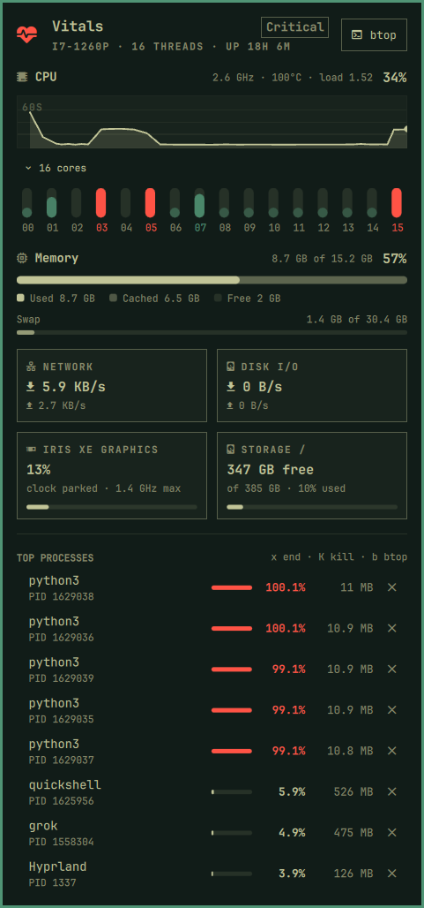

# Vitals

Live system vitals for the [Omarchy](https://omarchy.org) shell: a bar icon
that turns urgent when something is saturated, and a panel with CPU load and a
per-core heat map, a minute of history, memory with its cache segment, GPU,
storage, network and disk throughput, and the processes behind the numbers,
with a keyboard cursor and a two-step end/kill action.

Omarchy ships a battery panel and a display panel but nothing that answers
"what is my machine doing right now" without opening a terminal. This does,
in the shell's own components and theme.



## What it does

- **Bar icon.** A heartbeat glyph in the bar's foreground color; it switches
  to the theme's urgent color when CPU, memory, or package temperature crosses
  the critical threshold. Right-click shows the CPU percentage next to it,
  middle-click opens `btop`.
- **CPU.** Total load with clock, package temperature, and load average; a
  60-second history sparkline; and, behind a disclosure row that names the
  busiest core, one vertical meter per logical core in the accent color
  (urgent once a core is pinned).
- **Memory.** Used and cached as two segments of one bar, with a legend, plus
  a thin swap bar when swap exists.
- **Tiles.** Network and disk throughput, GPU utilization with clock and
  temperature, and free space on `/` (and `/home` when it is a separate
  filesystem).
- **Top processes.** Sorted by CPU then memory, with owner, a load bar, and
  resident size. `j`/`k` move, `x` asks a process to quit, `K` force-kills;
  every destructive action needs a second press within four seconds, and only
  processes you own are eligible.
- **Themed.** Every color, font, and spacing value comes from the shell's
  `Color`, `Style`, and `Border` singletons — there is no palette in this
  plugin, so `omarchy theme set` restyles it completely. Levels map onto the
  theme: foreground for normal, accent for elevated, urgent for critical.

## Requirements

- **Omarchy 4.x.** The widget is a shell plugin (manifest `schemaVersion` 1)
  and builds its UI from the shell's own `qs.Ui` components and `Style`/`Color`
  singletons. Those are internal shell API, so a much older or newer shell may
  not load it. Developed against Omarchy 4.0.2 with Quickshell 0.3.1.
- **Python 3**, which Omarchy installs. The collector uses only the standard
  library.

Nothing else. No daemons, no elevated permissions, no packages. The GPU tile
uses `nvidia-smi` when present, and sysfs for AMD and Intel otherwise.

## Install

```bash
omarchy plugin add https://github.com/tzglobic/omarchy-vitals.git --enable
```

Or clone into place and rescan:

```bash
git clone https://github.com/tzglobic/omarchy-vitals.git \
  ~/.config/omarchy/plugins/tzglobic.vitals
omarchy-shell shell rescanPlugins
omarchy plugin enable tzglobic.vitals --section right
```

## Uninstall

```bash
omarchy plugin remove tzglobic.vitals
```

The plugin keeps no state on disk, so removing it leaves nothing behind.

## Keyboard

| Key | Action |
|---|---|
| `j` / `k`, `↓` / `↑` | Move the cursor through the process list |
| `x` | Ask the selected process to quit (SIGTERM) — press twice |
| `K` | Force-kill the selected process (SIGKILL) — press twice |
| `Enter` / `Space` | Same as `x` |
| `r` | Sample right now |
| `c` | Expand or collapse the per-core meters (remembered) |
| `b` | Open `btop` and close the panel |
| `Tab` / `Shift+Tab` | Switch to the neighbouring bar panel |
| `Esc` | Close |

## Settings

Tunable from the shell like any first-party widget:

```bash
omarchy bar set tzglobic.vitals refreshIntervalSec 5
omarchy bar set tzglobic.vitals temperatureUnit F
omarchy bar set tzglobic.vitals processCount 12
```

| Key | Default | Meaning |
|---|---|---|
| `refreshIntervalSec` | `2` | Sampling cadence while the panel is closed; it samples every second while open |
| `showLabel` | `false` | Show the CPU percentage in the bar (right-click toggles it) |
| `coresExpanded` | `false` | Show the per-core meters; the `c` key and the disclosure row toggle it and remember the choice |
| `processCount` | `8` | Rows in the process list |
| `temperatureUnit` | `C` | `C` or `F` |
| `warnPercent` | `75` | CPU or memory at or above this is *elevated* (accent color) |
| `criticalPercent` | `90` | …and at or above this is *critical* (urgent color, lit bar icon) |

Package temperature has fixed thresholds of 85 °C (elevated) and 95 °C
(critical), because those are about the silicon rather than about taste.

## Scripting

The panel registers an IPC target, so it can be driven from a keybind or a
script:

```bash
omarchy-shell vitals open       # or close / toggle
omarchy-shell vitals refresh    # sample now
omarchy-shell vitals btop       # launch btop
omarchy-shell vitals cores      # expand or collapse the per-core meters
omarchy-shell vitals state      # the latest sample as JSON
omarchy-shell vitals snapshot ~/Pictures/vitals.png   # render the open panel to PNG
```

`snapshot` draws the panel card itself rather than grabbing the screen, so it
frames exactly the panel at native resolution — it is how `preview.png` in
this repository is produced.

The collector is a standalone program and is useful on its own:

```bash
bin/omarchy-vitals --once | jq .cpu
bin/omarchy-vitals --stream --interval 1        # one JSON line per second
```

## How it reads your system

Everything comes from `/proc` and `/sys`, read as you: `/proc/stat`,
`/proc/meminfo`, `/proc/diskstats`, `/proc/net/dev`, `/proc/loadavg`,
`/proc/<pid>/stat`, cpufreq and hwmon under `/sys`. The collector runs as a
child of the shell, one per bar (so one per monitor), and streams a JSON
document per tick. The panel talks back over stdin — `interval 1`, `procs on`
— so opening the panel speeds sampling up and adds the process scan without
restarting the process, which would otherwise lose the rate baselines and
history. Closed, a tick costs a handful of small file reads.

**GPU utilization on Intel is an estimate.** Intel's driver exposes no busy
counter to unprivileged users, so the tile derives load from time spent
outside the RC6 idle state, with the clock shown alongside as ground truth.
AMD reports `gpu_busy_percent` directly; NVIDIA goes through `nvidia-smi`.

**Ending a process is deliberately two steps.** The first `x` (or click on
the ✕) arms the row and shows what is about to happen; the second, within
four seconds, delivers the signal. Moving the cursor disarms. The collector
re-checks that the process is yours immediately before signalling, refuses
PID 1, and refuses the shell that hosts the panel.

## Layout

| Path | Role |
|------|------|
| `Panel.qml` | Bar button, panel, sparkline, heat map, tiles, process list |
| `Model.js` | Pure presentation logic — formatting, levels, history geometry |
| `bin/omarchy-vitals` | The collector: `/proc` and `/sys` to JSON, plus the signal action |
| `test/model.test.js` | Presentation logic, run with `node` |
| `test/collector.test.py` | Parsers against fixtures, then one real sample |

`Model.js` holds no QML imports and no side effects, so the same code runs
under Quickshell's JS engine and under `node`.

## Tests

```bash
node test/model.test.js
python3 test/collector.test.py
```

Neither signals a process; the collector test reads your machine once, the
same way the panel does.

## Developing

The shell only hot-reloads plugins under `~/.config/omarchy/plugins/`, and it
does not follow symlinks out of that directory. If you develop the repo
elsewhere and symlink it in, apply changes with:

```bash
omarchy restart shell
```

Even for a plugin copied into place, a restart is the reliable path: the
hot reload re-instantiates `Panel.qml` but serves `Model.js` from the QML
engine's cache, and the reloaded panel's IPC target can end up stale. The
collector is restarted either way, so `bin/omarchy-vitals` edits do take
effect on reload.

Check the shell log for QML errors with
`journalctl --user -o cat _COMM=quickshell -f`.

## License

MIT
